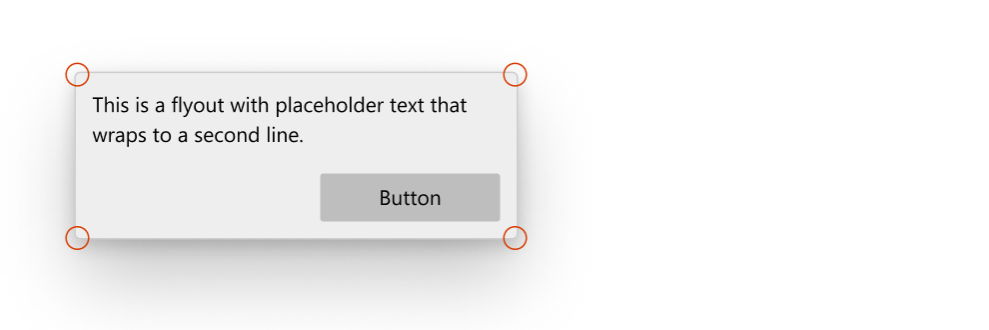
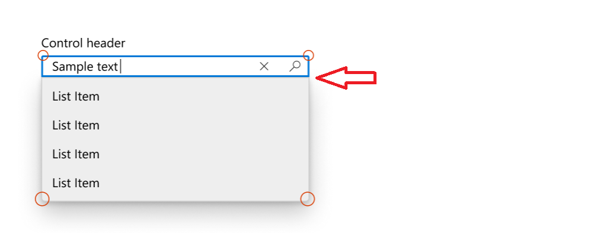

# Corner radius

Starting with version 2.2 of the [Windows UI Library](/uwp/toolkits/winui/) (WinUI), the default style for many controls has been updated to use rounded corners. These new styles are intended to evoke warmth and trust, and make the UI easier for users to visually process.

Here are two Button controls, the first without rounded corners and the second using a rounded corner style.


WinUI provides you with the updated styles for both WinUI and platform controls. See [Customization options](#customization-options), for details on how to customize rounded corners.

> [!IMPORTANT]
> Some controls are available both in the platform ([Windows.UI.Xaml.Controls](/uwp/api/windows.ui.xaml.controls)) and in WinUI ([Microsoft.UI.Xaml.Controls](/uwp/api/microsoft.ui.xaml.controls?view=winui-2.2&preserve-view=true)); for example, **TreeView** or **ColorPicker**. When you use WinUI in your app, you should use the WinUI version of the control. Corner rounding might be applied inconsistently in the platform version when used with WinUI.

> **Important APIs**: [Control.CornerRadius property](/uwp/api/windows.ui.xaml.controls.control.cornerradius)

## Default control designs

There are three areas of the controls where the rounded corner styles are used: rectangular elements, flyout elements, and bar elements.

### Corners of rectangle UI elements

- These UI elements include basic controls like buttons that users see on screen at all times.
- The default radius value we use for these UI elements is **4px**.


**Controls**

- AutoSuggestBox
- Buttons
  - ContentDialog buttons
- CalendarDatePicker
- CheckBox
  - TreeView, GridView, and ListView multi-select check boxes
- Color picker
- CommandBar
- ComboBox
- DatePicker
- DropDownButton
- Expander
- FlipView
- GridView and ListView
    - AutoSuggestBox, ComboBox, DatePicker, MenuBar, NavigationView, TimePicker, TreeView list
- InfoBar
- Inking controls
- Media playback
- MenuBar
- NumberBox
- PasswordBox
- RichEditBox
- SplitButton
- TextBox
- TimePicker
- ToggleButton
- ToggleSplitButton

### Corners of flyout and overlay UI elements

- These can be transient UI elements that appear on screen temporarily, like MenuFlyout, or elements that overlay other UI, like TabView tabs.
- The default radius value we use for these UI elements is **8px**.



**Controls**

- CommandBarFlyout
- ContentDialog
- Flyout
- MenuFlyout
- TabView tabs
- TeachingTip
- ToolTip (uses **4px** radius due to small size)
- Flyout part (when open)
  - AutoSuggestBox
  - CalendarDatePicker
  - ComboBox
  - DatePicker
  - DropDownButton
  - Inking control
  - MenuBar
  - NumberBox
  - SplitButton
  - TimePicker
  - ToggleSplitButton

### Bar elements

- These UI elements are shaped like bars or lines; for example, ProgressBar.
- The default radius values we use here are **4px**.


**Controls**

- NavigationView selection indicator
- ProgressBar
- ScrollBar
- Slider
  - ColorPicker color slider
  - MediaTransportControls seek bar slider

## Customization options

The default corner radii values that we provide are not set in stone and there are a few ways you can easily modify the amount of rounding on the corners. This can be done through two global resources, or through the [CornerRadius](/uwp/api/windows.ui.xaml.controls.control.cornerradius) property directly on the control, depending on the level of customization granularity you want.

### When not to round

There are instances where the corner of a control should not be rounded, and we don't round these by default.

- When multiple UI elements that are housed inside a container touch each other, such as the two parts of a SplitButton. There should be no space when they contact.


- When a flyout UI element is connected to a UI that invokes the flyout on one side.



### Page or app-wide CornerRadius changes

There are 2 app resources that control the corner radii of all the controls:

- `ControlCornerRadius` - default is 4px.
- `OverlayCornerRadius` - default is 8px.

If you override the value of these resources at any scope, it will affect all controls within that scope accordingly.

This means if you want to change the roundness of all controls where roundness could be applied, you can define both resources at the app level with the new CornerRadius values like this:

```xaml
<Application
    xmlns=”http://schemas.microsoft.com/winfx/2006/xamlpresentation”
    xmlns:x=”http://schemas.micosoft.com/winfx/2006/xaml”
    xmlns:control=”using:Microsoft.UI.Xaml.Controls”>
    <Application.Resources>
      <controls:XamlControlsResources>
        <controls:XamlControlsResources.MergedDictionaries>
          <ResourceDictionary>
            <CornerRadius x:Key="OverlayCornerRadius">0</CornerRadius>
            <CornerRadius x:Key="ControlCornerRadius">0</CornerRadius>
          </ResourceDictionary>
        </controls:XamlControlsResources.MergedDictionaries>
      </controls:XamlControlsResources>
    </Application.Resources>
</Application>


```

Alternatively, if you want to change all controls' roundness within a particular scope, like at a page or container level, you can follow a similar pattern:

```xaml
<Grid>
    <Grid.Resources>
        <CornerRadius x:Key="ControlCornerRadius">8</CornerRadius>
    </Grid.Resources>
    <Button Content="Button"/>
</Grid>
```

> [!NOTE]
> The `OverlayCornerRadius` resource must be defined at the app level in order to take effect.
>
>This is because popup and flyouts are not in to the page’s visual tree, they are added to the Popup Root. The resource resolution system does not properly traverse the Popup Root visual tree into the Page’s visual tree.

### Per-control CornerRadius changes

You can modify the [CornerRadius](/uwp/api/windows.ui.xaml.controls.control.cornerradius) property on controls directly if you want to change the roundness of only a select number of controls.

|Default | Property modified |
|:-- |:-- |
|| |
|`<CheckBox Content="Checkbox"/>` | `<CheckBox Content="Checkbox" CornerRadius="5"/> ` |

Not all controls' corners will respond to their `CornerRadius` property being modified. To ensure that the control whose corners you wish to round will indeed respond to their `CornerRadius` property the way you expect, first check that the `ControlCornerRadius` or `OverlayCornerRadius` global resources affect the control in question. If they do not, check that the control you wish to round has corners at all. Many of our controls do not render actual edges and therefore cannot make proper use of the `CornerRadius` property.

### Basing custom styles on WinUI

You can base your custom styles on the WinUI rounded corner styles by specifying the correct `BasedOn` attribute in your style. For example to create a custom button style based on WinUI button style, do the following:

```xaml
<Style x:Key="MyCustomButtonStyle" BasedOn="{StaticResource DefaultButtonStyle}">
   ...
</Style>
```

In general, WinUI control styles follow a consistent naming convention: "DefaultXYZStyle" where "XYZ" is the name of the control. For full reference, you can browse the XAML files in the WinUI repository.
