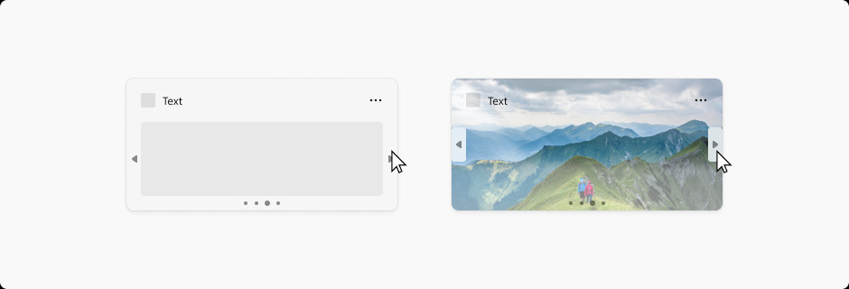
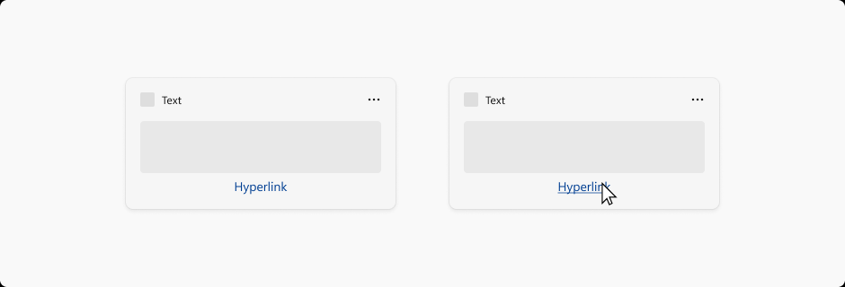

# Widget interaction design guidance

> [!NOTE]
> **Some information relates to pre-released product, which may be substantially modified before it's commercially released. Microsoft makes no warranties, express or implied, with respect to the information provided here.**
> [!IMPORTANT]
> The feature described in this topic is available in Dev Channel preview builds of Windows starting with build 25217. For information on preview builds of Windows, see [Windows 10 Insider Preview](https://insider.windows.com/en-us/preview-windows).

This article provides detailed guidance for designing interaction for Windows widgets.

## Navigation

A widget should be glanceable and focused, and should represent a single aspect of the app’s primary purpose. Widgets may provide one or more calls to action. When the user clicks on a call to action, the widget should launch the associated app or website instead of implementing the action in the widget itself. A widget has only one primary page that can house multiple interactions. Clicking on an item in the widget should never take you to a completely different view of the widget. For example, in a weather widget you might show the weather for multiple days but clicking on one of the days will not expand details inline, but will instead launch the app or web.

The following are the maximum number of touch points recommended for each supported widget size.

| Widget size | Maximum touchpoints |
|-------------|----------------------|
| small    | 1 |
| medium | 3 |
| large | 4 |

The following navigation elements are not supported in Windows Widgets:

- Pivots will not be supported within widgets
- L2 Pages will not be supported within widgets
- Vertical or horizontal scrolling will not be supported within Widgets

## Containers

The following images show example uses of container elements in a widget template. The containers group visual elements into columns and rows to create a hierarchical grid structure.

## Image links

The following images show example uses of image link elements in a widget template. 

## Pagination

The following images show examples of pagination in a widget template. The pagination controls can be aligned horizontally or vertically. Navigation arrows appear in response to a cursor hover. 

## Hyperlinks

The following images show example of hyperlinks in a widget template.

## Dropdown menus

Widgets are able to extend slightly beyond their widget size temporarily if the user is interacting with a menu or dropdown. The menu behavior should be light dismiss and close the menu if a user click outside of the menu / dropdown area.

 

 

