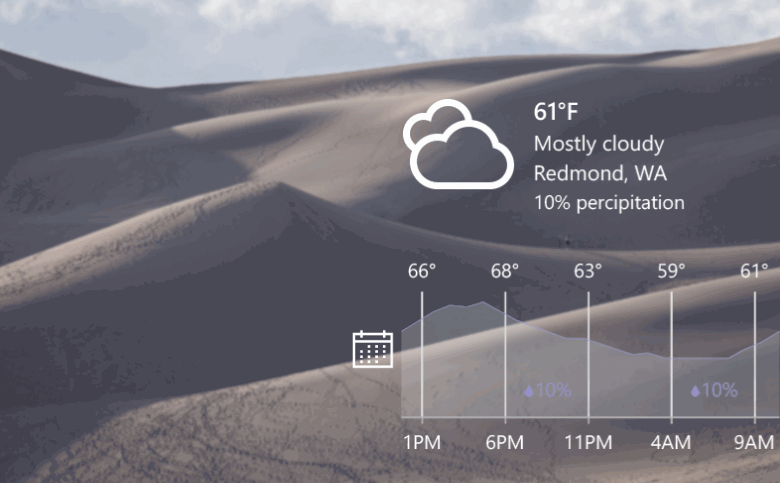
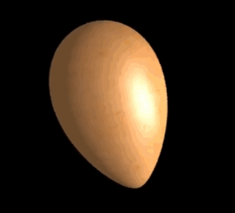
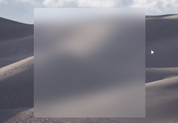
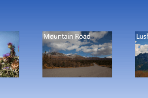

# Using the Visual layer in desktop apps

You can now use Windows Runtime APIs in non-UWP desktop applications to enhance the look, feel, and functionality of your WPF, Windows Forms, and C++ Win32 applications, and take advantage of the latest Windows UI features that are only available via UWP.

For many scenarios, you can use [XAML islands](xaml-islands.md) to add modern XAML controls to your app. However, when you need to create custom experiences that go beyond the built-in controls, you can access the Visual layer APIs.

The Visual layer provides a high performance, retained-mode API for graphics, effects, and animations. It's the foundation for UI across Windows devices. UWP XAML controls are built on the Visual layer, and it enables many aspects of the [Fluent Design System](/windows/uwp/design/fluent-design-system/index), such as Light, Depth, Motion, Material, and Scale.

> _User interface created with the visual layer_

## Create a visually engaging user interface in any Windows app

The Visual layer lets you create engaging experiences by using lightweight compositing of custom drawn content (visuals) and applying powerful animations, effects, and manipulations on those objects in your application. The Visual layer doesn't replace any existing UI framework; instead, it's a valuable supplement to those frameworks.

You can use the Visual layer to give your application a unique look and feel, and establish an identity that sets it apart from other applications. It also enables Fluent Design principles, which are designed to make your applications easier to use, drawing more engagement from users. For example, you can use it to create visual cues and animated screen transitions that show relationships among items on the screen.

## Visual layer features

### Brushes

[Composition brushes](/windows/uwp/composition/composition-brushes) let you paint UI objects with solid colors, gradients, images, videos, complex effects, and more.

> _An egg created with the [Material Creator demo app](https://github.com/Microsoft/WindowsCompositionSamples/tree/master/Demos/MaterialCreator)._

### Effects

[Composition effects](/windows/uwp/composition/composition-effects) include light, shadow, and a list of filter effects. They can be animated, customized, and chained, then applied directly to visuals. The SceneLightingEffect can be combined with composition lighting to create atmosphere, depth and materials.

> _Lights and material demonstrated in the [Windows UI Composition sample gallery](https://github.com/Microsoft/WindowsCompositionSamples/tree/master/SampleGallery)._

### Animations

[Composition animations](/windows/uwp/composition/composition-animation) run directly in the compositor process, independent of the UI thread. This ensures smoothness and scale, so you can run large numbers of concurrent, explicit animations. In addition to familiar KeyFrame animations to drive property changes over time, you can use expressions to set up mathematical relationships between different properties, including user input. Input driven animations let you create UI that dynamically and fluidly responds to user input, which can result in higher user engagement.

> _Motion demonstrated in the [Windows UI Composition sample gallery](https://github.com/Microsoft/WindowsCompositionSamples/tree/master/SampleGallery)._

## Keep your existing codebase and adopt incrementally

The code in your existing applications represents a significant investment that you don't want to lose. You can migrate _islands_ of content to use the Visual layer and keep the rest of the UI in its existing framework. This means you can make significant updates and enhancements to your application UI without needing to make extensive changes to your existing code base.

## Samples and tutorials

Learn how to use the Visual layer in your applications by experimenting with our samples. These samples and tutorials help you get started using the Visual layer and show you how features work.

### Win32

- [Using the Visual layer with Win32](using-the-visual-layer-with-win32.md) tutorial
  - [Hello Composition sample](https://github.com/Microsoft/Windows.UI.Composition-Win32-Samples/tree/master/cpp/HelloComposition)
- [Hello Vectors sample](https://github.com/Microsoft/Windows.UI.Composition-Win32-Samples/tree/master/cpp/HelloVectors)
- [Virtual Surfaces sample](https://github.com/Microsoft/Windows.UI.Composition-Win32-Samples/tree/master/cpp/VirtualSurfaces)
- [Screen Capture sample](https://github.com/Microsoft/Windows.UI.Composition-Win32-Samples/tree/master/cpp/ScreenCaptureforHWND)

### Windows Forms

- [Using the Visual layer with Windows Forms](using-the-visual-layer-with-windows-forms.md) tutorial
  - [Hello Composition sample](https://github.com/Microsoft/Windows.UI.Composition-Win32-Samples/tree/master/dotnet/WinForms/HelloComposition)
- [Visual Layer Integration sample](https://github.com/Microsoft/Windows.UI.Composition-Win32-Samples/tree/master/dotnet/WinForms/VisualLayerIntegration)

### WPF

- [Using the Visual layer with WPF](using-the-visual-layer-with-wpf.md) tutorial
  - [Hello Composition sample](https://github.com/Microsoft/Windows.UI.Composition-Win32-Samples/tree/master/dotnet/WPF/HelloComposition)
- [Visual Layer Integration sample](https://github.com/Microsoft/Windows.UI.Composition-Win32-Samples/tree/master/dotnet/WPF/VisualLayerIntegration)
- [Screen Capture sample](https://github.com/Microsoft/Windows.UI.Composition-Win32-Samples/tree/master/dotnet/WPF/ScreenCapture)

## Limitations

While many Visual Layer features work the same when hosted in a desktop application as they do in a UWP app, some features do have limitations. Here are some of the limitations to be aware of:

- Effect chains rely on [Win2D](http://microsoft.github.io/Win2D/html/Introduction.htm) for the effect descriptions. The [Win2D NuGet package](https://www.nuget.org/packages/Win2D.uwp) is not supported in desktop applications, so you would need to recompile it from the [source code](https://github.com/Microsoft/Win2D).
- To do hit testing, you need to do bounds calculations by walking the visual tree yourself. This is the same as the Visual Layer in UWP, except in this case there's no XAML element you can easily bind to for hit testing.
- The Visual Layer does not have a primitive for rendering text.
- When two different UI technologies are used together, such as WPF and the Visual Layer, they are each responsible for drawing their own pixels on the screen, and they can't share pixels. As a result, Visual Layer content is always rendered on top of other UI content. (This is known as the _airspace_ issue.) You might need to do extra coding and testing to ensure your Visual layer content resizes with the host UI and doesn't occlude other content.
- Content hosted in a desktop application doesn't automatically resize or scale for DPI. Extra steps might required to ensure your content handles DPI changes. (See the platform specific tutorials for more info.)

## Additional Resources

- [Visual layer](/windows/uwp/composition/visual-layer)
- [Composition visual](/windows/uwp/composition/composition-visual-tree)
- [Composition brushes](/windows/uwp/composition/composition-brushes)
- [Composition effects](/windows/uwp/composition/composition-effects)
- [Composition animations](/windows/uwp/composition/composition-animation)

API reference

- [Windows.UI.Composition](/uwp/api/Windows.UI.Composition)